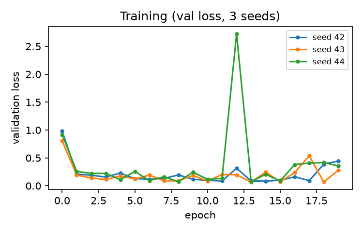
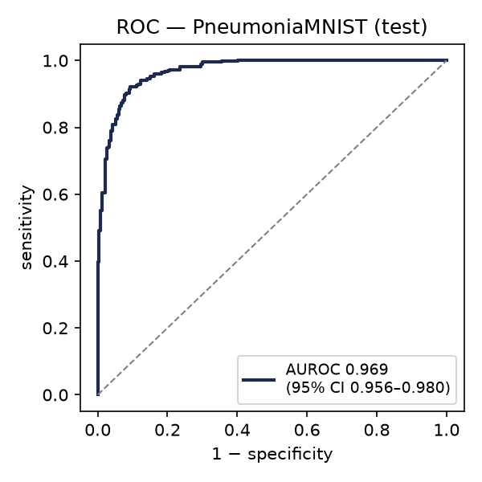
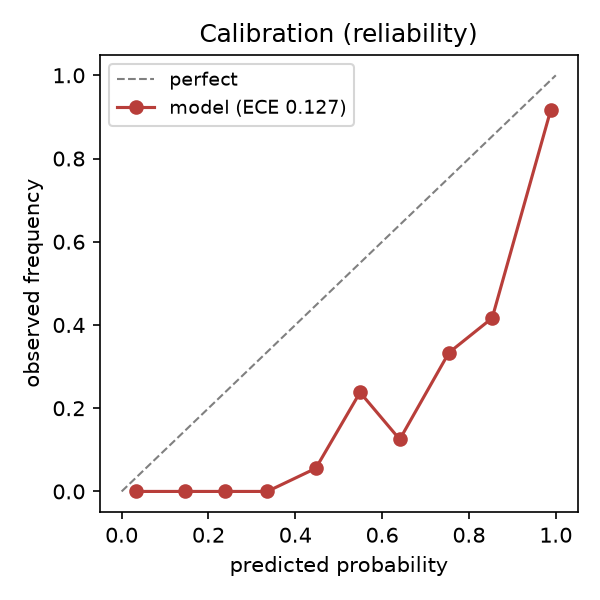
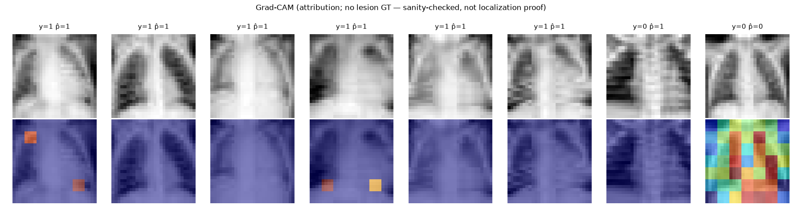

## Abstract

**Background and objective.** Agentic AI toolkits can scaffold model code, but a clinician-researcher
needs the *whole* pipeline — data preparation, split, training, evaluation, calibration, and
interpretability — to be leakage-safe, reproducible, and reported to a recognised standard. We
demonstrate one such toolkit (MedSci Skills) end to end on a public benchmark, and report what an
agent-orchestrated, deterministically-gated pipeline actually produces. This is a **methods / tooling
demonstration, not a clinical claim.**

**Methods.** Using the toolkit's model-engineering lane, we scaffolded a hygiene-clean PyTorch training
repository, wired the **PneumoniaMNIST** dataset (MedMNIST v2, CC BY 4.0; official image-level split),
trained a small convolutional network over three seeds, and evaluated once on the held-out test set.
Two deterministic gates were enforced before training: a split-disjointness proof and a training-hygiene
linter. Calibration and Grad-CAM interpretability (with Adebayo sanity checks) were computed, and the
explainability analysis was passed through the toolkit's explainability-reporting gate. Every reported
number comes from the executed run.

**Results.** On the test set (n = 624, prevalence 0.625), test AUROC was **0.964 ± 0.004** over three
seeds; a three-seed probability ensemble reached **AUROC 0.969 (95% CI 0.956–0.980)** and **AUPRC 0.980
(95% CI 0.970–0.988)**. Expected calibration error was 0.127 (Brier 0.103), indicating the raw model is
imperfectly calibrated. Grad-CAM attributions passed both Adebayo sanity checks (model-randomisation
r = −0.07; label-permutation r = −0.03), and the explainability-reporting gate returned no violations.
The entire pipeline ran locally on a laptop GPU (Apple M5, MPS) in minutes.

**Conclusion.** An agent-orchestrated pipeline with deterministic reproducibility gates produced a
leakage-safe, calibrated, sanity-checked, and standard-reported CNN result on a public benchmark, with no
hand-entered metrics. The workflow is offered as a reproducible template; it makes no clinical claim.

## Introduction

Clinician-researchers increasingly build imaging models without a dedicated engineer, and large-language-model
agents can now scaffold the code. The risk is that the *convenience* of scaffolding outruns the *rigor*:
image-level rather than patient-level splits, unrecorded seeds, dropout left on at inference, uncalibrated
probabilities reported as if trustworthy, and saliency maps presented as proof of correctness are all
well-documented failure modes. The question this note addresses is narrow and practical: when an
agent-orchestrated toolkit drives the whole pipeline behind deterministic gates, what does the end-to-end
artifact look like, and does it clear the checks a reviewer would apply? We answer by running one toolkit
(MedSci Skills) from architecture choice to a reported result on a public benchmark, and we frame the
result honestly as a demonstration of the *tooling*, not a clinical finding.

## Methods

**Toolkit and gates.** We used the MedSci Skills model-engineering lane (open source; archived at
doi:10.5281/zenodo.20155321). The lane chooses an architecture, scaffolds a runnable training repository
with reproducibility guarantees baked in, and enforces deterministic, network-free gates: a **split-leakage
gate** (proves the train/validation/test partitions are disjoint by set arithmetic on the sample IDs, with
a recorded seed) and a **training-hygiene gate** (an AST linter requiring every RNG seeded, cuDNN
deterministic, evaluation under `eval()` + `no_grad()`, and the training loader built from the train split
only). Both gates passed before any training ran.

**Dataset and split.** PneumoniaMNIST (MedMNIST v2), 28×28 grayscale paediatric chest-radiograph images
derived from Kermany et al., under CC BY 4.0 (SHA-256 of the source archive `e1792d3f03751cb1…`). We used
MedMNIST's predefined train/validation/test split — the accepted image-level benchmark protocol.
PneumoniaMNIST is an image-level benchmark with no patient grouping; the split-leakage gate confirms the
partitions are disjoint at the sample level. For a real patient dataset the same gate is applied at the
patient level.

**Model and training.** A small convolutional network (three conv blocks + global pooling + a linear head;
the scaffold's default, CPU-smoke-testable) was trained with Adam (lr 1e-3), cross-entropy loss, batch
size 128, for 20 epochs, selecting the best checkpoint on the validation split. Training was repeated for
seeds 42, 43, and 44; because GPU operations are not fully deterministic (Metal/MPS backend), performance
is reported as mean ± SD over the three seeds, per the scaffold's reproducibility rule. The test split was
touched once, by the evaluation script.

**Evaluation, calibration, interpretability.** Held-out discrimination was summarised by AUROC and AUPRC
(scikit-learn); a three-seed probability ensemble was formed and its AUROC/AUPRC 95% confidence intervals
were obtained by bootstrap resampling of the test set (2000 replicates). Calibration was summarised by
expected calibration error (10 bins) and the Brier score. Interpretability used Grad-CAM (captum
LayerGradCam on the last convolutional layer) with two Adebayo sanity checks — model randomisation and
training-label permutation — quantified as the Pearson correlation between the trained model's attributions
and the control model's. The explainability analysis was recorded as a manifest and passed through the
toolkit's explainability-reporting gate. Because PneumoniaMNIST has no lesion masks, a quantitative
localisation metric (IoU / pointing game) is not computable; the maps are reported as attribution, not as
localisation proof.

**Environment.** torch 2.12.1, medmnist 3.0.2, scikit-learn 1.9.0, captum 0.9.0, Python 3.13, on an Apple
M5 (MPS) laptop.

## Results

Both pre-training gates passed (disjoint split with recorded seed; hygiene-clean training and evaluation
code). Over three seeds the test AUROC was **0.964 ± 0.004** (per-seed 0.967 / 0.959 / 0.966), AUPRC
**0.975 ± 0.004**, and accuracy at a 0.5 threshold 0.860 ± 0.038 (n = 624, prevalence 0.625). The three-seed
ensemble reached **AUROC 0.969 (95% CI 0.956–0.980)** and **AUPRC 0.980 (95% CI 0.970–0.988)** (Figure 2),
consistent with published PneumoniaMNIST baselines (Yang et al.). Expected calibration error was 0.127 with
a Brier score of 0.103, i.e. the raw probabilities are over-confident; temperature scaling on the validation
split is the standard recalibration remedy and would precede any decision use (not applied here) (Figure 3). Grad-CAM attributions passed both sanity checks: attributions from a
randomly-initialised model and from a model trained on permuted labels were uncorrelated with the trained
model's (mean Pearson r −0.07 and −0.03, respectively), so the maps depend on the learned weights and
labels rather than on image edges alone; the explainability-reporting gate returned no violations. Training
converged within 20 epochs across seeds (Figure 1), and example attribution maps are shown in Figure 4. The
full pipeline — gates, three-seed training, evaluation, calibration, and interpretability — executed on a
laptop GPU in minutes.

## Discussion

The contribution here is not the model or its accuracy — PneumoniaMNIST is an easy benchmark and the result
is unremarkable by design — but the demonstration that an **agent-orchestrated pipeline with deterministic
gates** yields a leakage-safe, seed-averaged, calibration-reported, sanity-checked, and standard-reported
artifact end to end, with no hand-entered numbers. Two gate outcomes are worth noting because they are the
kind of thing that silently degrades unmentored pipelines: the calibration error (0.127) surfaced that a
seemingly strong classifier is over-confident, and the explainability gate's discipline forced the maps to
be reported as attribution rather than localisation, because the benchmark has no masks.

**Limitations.** This is a tooling demonstration on a public benchmark, not a clinical study.
PneumoniaMNIST is 28×28 and image-level; a clinical dataset would require patient-level splitting, native
resolution, external validation, and a prospective, calibrated, deployment-focused evaluation (which the
same toolkit supports but which are out of scope here). The MPS backend is not fully deterministic, which
is why results are reported over three seeds rather than a single run. The model is a small default network;
a pretrained backbone would likely do better but would not change the methodological point.

**Conclusion.** Deterministic reproducibility gates can be wired into an agent-orchestrated imaging-model
pipeline so that leakage-safety, seed-averaging, calibration, and interpretability-rigor are enforced by
construction rather than by reviewer vigilance. We release the runnable repository and the exact results as
a reproducible template.

## Figures

{width=60%}

{width=55%}

{width=55%}

{width=95%}

## Data and code availability

PneumoniaMNIST is public (MedMNIST v2, CC BY 4.0). The runnable repository (scaffold, gates, training,
evaluation, calibration, interpretability, and figure code) and the exact results manifest
(`results/results.json`) accompany this note. The MedSci Skills toolkit is open source (archived at
doi:10.5281/zenodo.20155321).

## Reproducibility

Seeds 42/43/44; best checkpoint selected on validation; test touched once. All metrics are computed by the
released code from the executed run — none are hand-entered. Package versions and the dataset hash are given
in Methods. Re-running `experiment.py` reproduces `results/results.json` up to MPS non-determinism (bounded
by the reported seed SD).

## References

*References were verified with `/verify-refs` (PubMed/CrossRef/OpenAlex): 8/9 auto-verified by DOI and
first-author cross-check; ref 7 (PyTorch) is a canonical software citation not indexed in the biomedical
sources and was manually confirmed (arXiv:1912.01703).*

1. Yang J, Shi R, Wei D, et al. MedMNIST v2 — A large-scale lightweight benchmark for 2D and 3D biomedical image classification. Sci Data. 2023;10:41.
2. Kermany DS, Goldbaum M, Cai W, et al. Identifying medical diagnoses and treatable diseases by image-based deep learning. Cell. 2018;172(5):1122-1131.
3. Adebayo J, Gilmer J, Muelly M, et al. Sanity checks for saliency maps. In: Advances in Neural Information Processing Systems (NeurIPS). 2018.
4. Selvaraju RR, Cogswell M, Das A, et al. Grad-CAM: visual explanations from deep networks via gradient-based localization. In: IEEE International Conference on Computer Vision (ICCV). 2017:618-626.
5. Kokhlikyan N, Miglani V, Martin M, et al. Captum: a unified and generic model interpretability library for PyTorch. arXiv:2009.07896. 2020.
6. Pedregosa F, Varoquaux G, Gramfort A, et al. Scikit-learn: machine learning in Python. J Mach Learn Res. 2011;12:2825-2830.
7. Paszke A, Gross S, Massa F, et al. PyTorch: an imperative style, high-performance deep learning library. In: NeurIPS. 2019. arXiv:1912.01703.
8. Tejani AS, Klontzas ME, Gatti AA, et al. Checklist for Artificial Intelligence in Medical Imaging (CLAIM): 2024 update. Radiol Artif Intell. 2024;6(4):e240300.
9. Collins GS, Moons KGM, Dhiman P, et al. TRIPOD+AI statement: updated guidance for reporting clinical prediction models that use regression or machine learning methods. BMJ. 2024;385:e078378.
